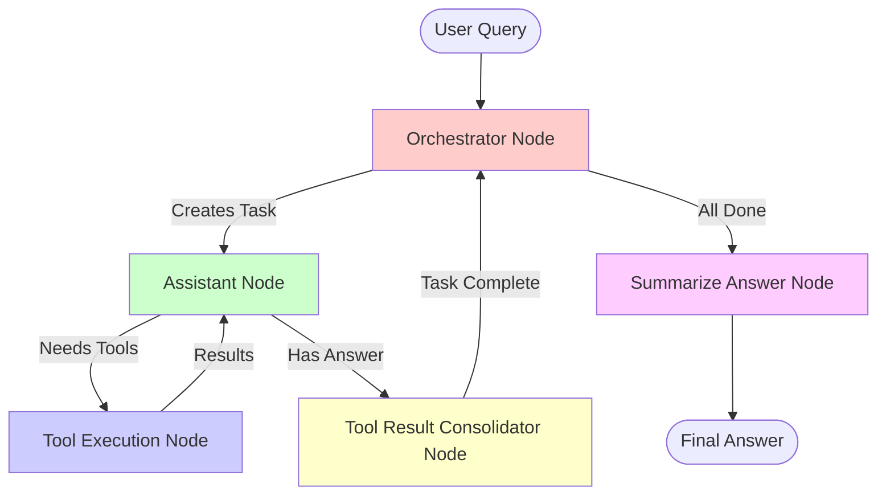

# LangChain Gemini Agent - General Purpose AI Agent with Chain-of-Thought Reasoning

This repository demonstrates a **general-purpose AI agent** built using LangChain and Google's Gemini models. The agent uses **Chain-of-Thought (CoT)** reasoning to solve complex problems step by step by breaking them down into smaller, manageable tasks.

## Overview

The `langchain_gemini_agent.py` implements an intelligent orchestration system that:
- **Decomposes complex queries** into smaller sub-tasks
- **Executes tasks systematically** using available tools
- **Demonstrates AI reasoning capabilities** through iterative problem-solving
- **Integrates with Elasticsearch** via Model Context Protocol (MCP) tools

This is a **demonstration agent** showcasing AI's ability to reason, plan, and adapt. For production use, additional enhancements would be needed (error recovery, human-in-the-loop validation, extended tool sets, etc.).

---

## Architecture: Multi-Node Agent Graph

The agent follows a graph-based architecture with specialized nodes, each serving a distinct role:

### Node Descriptions

#### 1. **Orchestrator Node**
- **Role**: Master planner and task coordinator
- **Responsibilities**:
  - Analyzes the user's original goal
  - Reviews completed tasks and established facts
  - Decides whether more work is needed or if the goal is met
  - Creates new sub-tasks as clear, actionable commands
  - Stops execution when sufficient information is gathered
- **Key Feature**: Uses CoT reasoning to avoid unnecessary work

#### 2. **Assistant Node** (`my_assistant`)
- **Role**: Principal Engineer / Worker Agent
- **Responsibilities**:
  - Receives a single task from the orchestrator
  - Analyzes available tools and decides which to use
  - Executes tool calls to gather information
  - Maintains a task-specific conversation history
  - Provides final answers or suggestions for each task
- **Key Feature**: Uses a global scratchpad to avoid redundant tool calls across different tasks

#### 3. **Tool Execution Node**
- **Role**: Tool executor and result aggregator
- **Responsibilities**:
  - Executes tool calls (potentially in parallel)
  - Handles tool failures gracefully
  - Returns results to the assistant for further processing
  - Updates both task-specific history and global scratchpad
- **Key Feature**: Executes multiple tool calls concurrently for efficiency

#### 4. **Tool Result Consolidator Node**
- **Role**: Task completion handler
- **Responsibilities**:
  - Extracts the final answer from the assistant's response
  - Stores the answer in the task record
  - Signals completion back to the orchestrator
- **Key Feature**: Ensures each task has a clear outcome before moving forward

#### 5. **Summarize Answer Node**
- **Role**: Final report generator
- **Responsibilities**:
  - Aggregates all completed tasks and their answers
  - Generates a comprehensive final response to the user
  - Presents the answer in a clear, concise format
- **Key Feature**: Synthesizes information from multiple sub-tasks into a cohesive answer

---

## Agent Workflow



### Execution Flow Characteristics

#### Task Breakdown Strategy
The orchestrator breaks down complex queries into discrete sub-tasks. For example, a query like *"Are there vessels that last visited the port of Miami within a 10km radius?"* might be broken down into:
1. Find all available Elasticsearch indices
2. Get the mapping for the vessel index
3. Search for vessels near Miami coordinates
4. Refine the query based on mapping constraints

#### Non-Deterministic Task Ordering
While the agent typically follows a logical progression (e.g., finding indices first, then getting mappings, then searching), the **exact order is not guaranteed**. The orchestrator makes dynamic decisions based on:
- What information has been gathered
- What the next most critical piece of information is
- Current task outcomes (success/failure)

#### Adaptive Reasoning Example
In a typical execution, you might observe:
1. **Discovery Phase**: Agent finds available indices
2. **Schema Understanding**: Agent requests mapping to understand data structure
3. **Initial Attempt**: Agent tries a search query
4. **Failure & Adaptation**: Query fails due to field type mismatch
5. **Refinement**: Agent rewrites the query based on mapping information
6. **Success**: Query executes successfully and returns results

This iterative process demonstrates the **AI's reasoning capabilities**it doesn't just execute pre-defined steps; it adapts based on feedback and learns from failures.

---

## Sample Tools: Elasticsearch Integration

The agent integrates with **Elasticsearch** through MCP (Model Context Protocol) tools located in `sample_tools/`. These are general-purpose tools for querying and exploring Elasticsearch data:

### Available Tools

1. **`get_all_elastic_indices()`**
   - Lists all healthy, non-system indices in Elasticsearch
   - Returns: Comma-separated string of index names

2. **`get_elastic_index_mapping(index_name: str)`**
   - Retrieves the mapping (schema) for a given index
   - Returns: Human-readable, indented structure of field names and types

3. **`run_elastic_query(index_name: str, query: str | Dict, output_format: str)`**
   - Executes Elasticsearch DSL queries
   - Supports both document search and aggregations
   - Returns: Formatted results (JSON or text summary)
   - Auto-limits results to prevent overwhelming the LLM

These tools enable the agent to:
- **Discover** available data sources
- **Understand** data structures
- **Query** data intelligently
- **Adapt** queries based on schema constraints

**Location**: `sample_tools/tools/elastic_tool.py`

---

## Getting Started

### Prerequisites

- Python 3.12+
- UV package manager
- Node.js (for MCP monitoring)
- Elasticsearch instance (local or remote)
- Google Gemini API key

### Installation

```bash
# Install dependencies using UV
uv sync
```

### Configuration

Create a `.env` file with the following variables:

```bash
GOOGLE_API_KEY=your_gemini_api_key_here
ELASTICSEARCH_URL=http://localhost:9200
ELASTICSEARCH_USERNAME=elastic
ELASTICSEARCH_PASSWORD=your_password
```

### Running the MCP Server

The agent requires an MCP server to provide tool access. Start the server using:

```bash
uv run sample_tools/server.py
```

This starts the MCP server on `http://127.0.0.1:8000/sse`.

### Monitoring MCP Server (Optional)

To inspect MCP server activity and tool calls, use the MCP Inspector:

```bash
npx @modelcontextprotocol/inspector
```

This provides a web interface to monitor:
- Available tools
- Tool invocations
- Request/response payloads
- Error messages

### Running the Agent

Execute the main agent script:

```bash
uv run agent_app/langchain_gemini_agent.py
```

---

## Example Execution Output

Below is a sample execution demonstrating the agent's reasoning flow:

```
"""
Initializing models...
- Orchestrator: gemini-2.5-flash
- Assistant: gemini-2.5-flash
- Summarizer: gemini-2.5-flash
WARNING: All log messages before absl::InitializeLog() is called are written to STDERR
E0000 00:00:1762129736.292367   49173 alts_credentials.cc:93] ALTS creds ignored. Not running on GCP and untrusted ALTS is not enabled.

--- Setting up tools ---

Successfully connected to MCP server and retrieved 3 tools.

--- Asking the graph: Are there a vessel last visited port of Miami. Like within 10km radius? ---

======================================================
--- Orchestrator Iteration: 0 / 9
======================================================
E0000 00:00:1762129741.326891   49173 alts_credentials.cc:93] ALTS creds ignored. Not running on GCP and untrusted ALTS is not enabled.
[Orchestrator]: New Task Created: Get the geographical coordinates for the Port of Miami.

   [Assistant] Task: "Get the geographical coordinates for the Port of Miami."
Key 'additionalProperties' is not supported in schema, ignoring
   [Assistant]: Calling tool(s): get_all_elastic_indices
      [Tool: get_all_elastic_indices] Executed

   [Assistant] Task: "Get the geographical coordinates for the Port of Miami."
Key 'additionalProperties' is not supported in schema, ignoring
   [Assistant]: Calling tool(s): get_elastic_index_mapping
      [Tool: get_elastic_index_mapping] Executed

   [Assistant] Task: "Get the geographical coordinates for the Port of Miami."
Key 'additionalProperties' is not supported in schema, ignoring
   [Assistant]: Calling tool(s): run_elastic_query
      [Tool: run_elastic_query] Executed

   [Assistant] Task: "Get the geographical coordinates for the Port of Miami."
Key 'additionalProperties' is not supported in schema, ignoring
   [Assistant]: Reaching a final answer.
   [Consolidator] Task: "Get the geographical coordinates for the Port of Miami."
   [Consolidator]: storing final answer...
   [Orchestrator]: Task reviewed task answer: "Final Answer: The geographical coordinates for the Port of Miami are latitude 25.783333 and longitude -80.183333."

======================================================
--- Orchestrator Iteration: 1 / 9
======================================================
[Orchestrator]: New Task Created: Find vessels whose last reported port visit is within 10km of latitude 25.783333, longitude -80.183333.

   [Assistant] Task: "Find vessels whose last reported port visit is within 10km of latitude 25.783333, longitude -80.183333."
Key 'additionalProperties' is not supported in schema, ignoring
   [Assistant]: Calling tool(s): get_elastic_index_mapping
      [Tool: get_elastic_index_mapping] Executed

   [Assistant] Task: "Find vessels whose last reported port visit is within 10km of latitude 25.783333, longitude -80.183333."
Key 'additionalProperties' is not supported in schema, ignoring
   [Assistant]: Calling tool(s): run_elastic_query
      [Tool: run_elastic_query] Executed

   [Assistant] Task: "Find vessels whose last reported port visit is within 10km of latitude 25.783333, longitude -80.183333."
Key 'additionalProperties' is not supported in schema, ignoring
   [Assistant]: Reaching a final answer.
   [Consolidator] Task: "Find vessels whose last reported port visit is within 10km of latitude 25.783333, longitude -80.183333."
   [Consolidator]: storing final answer...
   [Orchestrator]: Task reviewed task answer: "Final Answer: The following vessels had their last reported position within 10km of latitude 25.783333, longitude -80.183333 (Port of Miami):

*   **DREAM ON** (LAT: 25.83985, LON: -80.13398, BaseDateTime: 2022-01-01T00:00:50)
*   **SPAZZINO** (LAT: 25.70655, LON: -80.19348, BaseDateTime: 2022-01-01T00:00:53)
*   **HERON** (LAT: 25.76437, LON: -80.14562, BaseDateTime: 2022-01-01T00:00:49)
*   **MIZU** (LAT: 25.80031, LON: -80.25153, BaseDateTime: 2022-01-01T00:00:02)
*   **BETTY K VIII** (LAT: 25.80378, LON: -80.25572, BaseDateTime: 2022-01-01T00:00:54)
*   **MIZU** (LAT: 25.8003, LON: -80.25148, BaseDateTime: 2022-01-01T00:01:12)
*   **BALAJU** (LAT: 25.75629, LON: -80.14605, BaseDateTime: 2022-01-01T00:00:54)
*   **MR BENITO** (LAT: 25.79948, LON: -80.2499, BaseDateTime: 2022-01-01T00:00:03)
*   **MR BENITO** (LAT: 25.79949, LON: -80.24993, BaseDateTime: 2022-01-01T00:01:12)
*   **OSPREY** (LAT: 25.76432, LON: -80.13957, BaseDateTime: 2022-01-01T00:00:01)"

======================================================
--- Orchestrator Iteration: 2 / 9
======================================================
[Orchestrator]: All tasks are complete. Processing to summary.

----------------------------------------
--Summarizing Final Answer
----------------------------------------

[Final Summary]: Yes, there are vessels whose last reported position was within a 10km radius of the Port of Miami.

The following vessels were identified:

*   **DREAM ON**
*   **SPAZZINO**
*   **HERON**
*   **MIZU**
*   **BETTY K VIII**
*   **BALAJU**
*   **MR BENITO**
*   **OSPREY**

Example flow:
1. Orchestrator creates task: "Find all Elasticsearch indices"
2. Assistant calls get_all_elastic_indices()
3. Tool returns: vessel_locations, port_data
4. Orchestrator creates task: "Get mapping for vessel_locations index"
5. Assistant calls get_elastic_index_mapping(vessel_locations)
6. Tool returns schema with geo_point fields
7. Orchestrator creates task: "Search for vessels near Miami"
8. Assistant attempts query, receives error about field type
9. Assistant rewrites query using correct geo_distance syntax
10. Query succeeds, returns vessel data
11. Summarizer generates final answer
"""
```

---

## Key Takeaways

### Demonstrated AI Capabilities

1. **Task Decomposition**: Breaking complex problems into manageable steps
2. **Adaptive Reasoning**: Learning from failures and adjusting strategies
3. **Tool Selection**: Choosing appropriate tools based on task requirements
4. **Context Awareness**: Using global scratchpad to avoid redundant operations
5. **Goal-Oriented Execution**: Stopping when sufficient information is gathered

### Production Considerations

This is a **demonstration agent**. For production deployment, consider:

- **Enhanced Error Handling**: Retry logic, fallback strategies
- **Human-in-the-Loop**: Approval gates for critical operations
- **Extended Tool Suite**: Integration with more data sources and APIs
- **Performance Optimization**: Caching, parallel task execution
- **Security**: Input validation, sandboxed tool execution
- **Observability**: Logging, tracing, metrics collection
- **Scalability**: Distributed task execution, load balancing

---

## Project Structure

```
agent_sanbox/
 agent_app/
    langchain_gemini_agent.py   # Main agent implementation
    llm_factory.py               # LLM provider abstraction
    config.py                    # Configuration management
 sample_tools/
    server.py                    # MCP server implementation
    tools/
        elastic.py               # Elasticsearch client
        elastic_tool.py          # MCP tool wrappers
 tests/                           # Test suite
 .env                             # Environment variables
 pyproject.toml                   # Project dependencies
 README.md                        # This file
```

---

## License

MIT License

---

## Contributing

Contributions are welcome! Please open an issue or submit a pull request.

---

## Acknowledgments

- Built with [LangChain](https://langchain.com/)
- Powered by [Google Gemini](https://deepmind.google/technologies/gemini/)
- Tool integration via [Model Context Protocol](https://modelcontextprotocol.io/)
